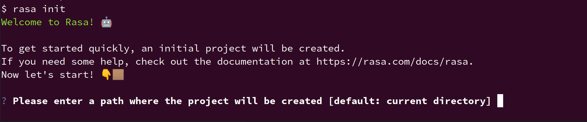

# [Chapter 01] 人机对话基础和 Rasa 简介

## Rasa 版本和项目依赖

本书所用代码均在 Rasa 3.0.X 版本中完成。
读者可以使用：

```shell
pip install --no-deps -r ../full_requirements.txt
```

完成项目代码的依赖安装。

## 建立初始化项目

```shell
rasa init
```

程序运行效果如下所示：



玩得开心！
