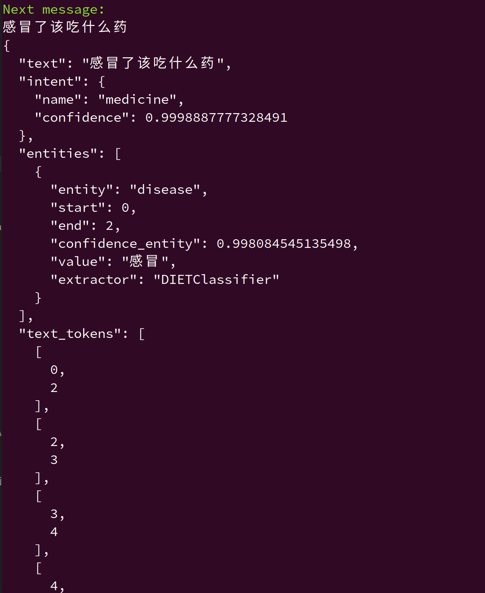

# [Chapter 02] Rasa NLU 基础

## Rasa 版本和项目依赖

本书所用代码均在 Rasa 3.0.X 版本中完成。
读者可以使用：

```shell
pip install --no-deps -r ../full_requirements.txt
```

完成项目代码的依赖安装。

## 训练 Rasa NLU 模型

```shell
rasa train nlu
```

## 设置模型服务器并进行推理

```shell
rasa shell nlu
```

尝试输入一些查询，例如“如果我感冒了，我应该吃什么药”并查看回复。

演示效果如下所示：



玩得开心！
