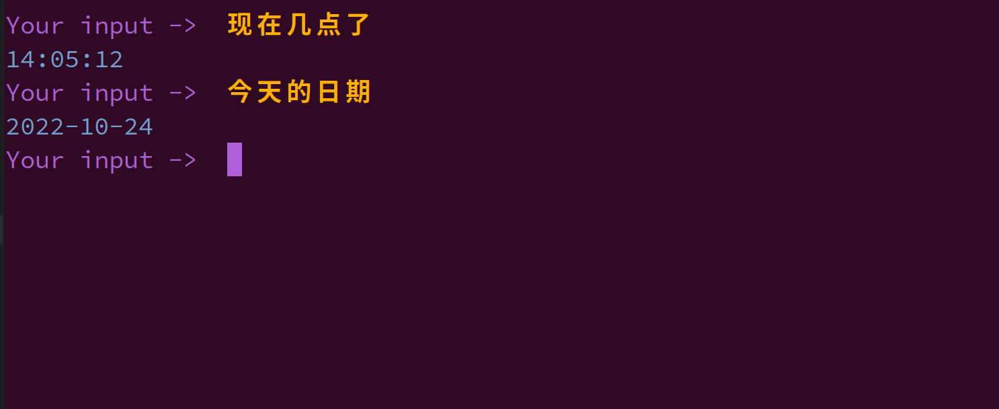

# [Chapter 03] Rasa Core 基础

## Rasa 版本和项目依赖

本书所用代码均在 Rasa 3.0.X 版本中完成。
读者可以使用：

```shell
pip install --no-deps -r ../full_requirements.txt
```

完成项目代码的依赖安装。

## 训练 Rasa 模型

```shell
rasa train
```

## 启动 Rasa 动作服务器

```shell
rasa run actions
```

## 启动 Rasa 服务器和客户端

```shell
rasa shell
```

尝试输入一些查询，例如“现在几点了？”并查看响应。

演示效果如下所示：



玩得开心！
