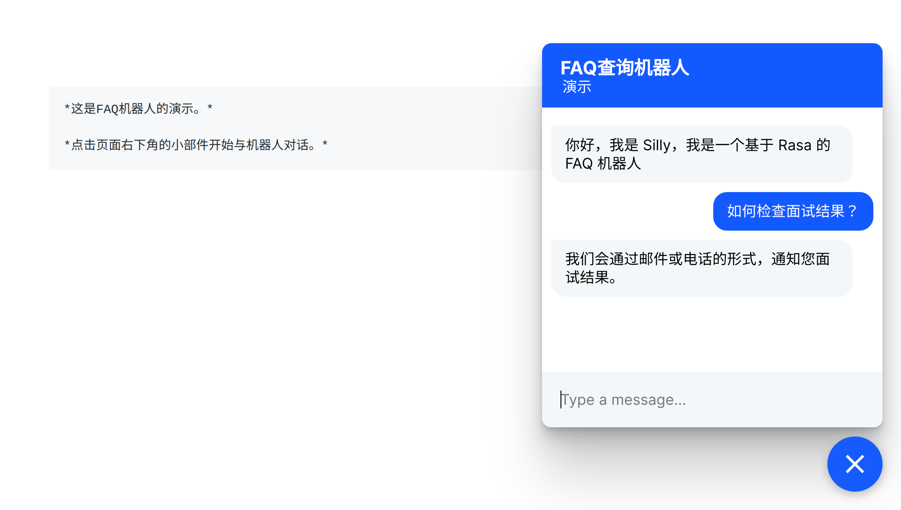

# [Chapter 04] 使用 ResponseSelector 实现 FAQ 和闲聊功能

## Rasa 版本和项目依赖

本书所用代码均在 Rasa 3.0.X 版本中完成。
读者可以使用：

```shell
pip install --no-deps -r ../full_requirements.txt
```

完成项目代码的依赖安装。

## 训练 Rasa 模型

```bash
rasa train
```

## 启动 Rasa 服务器和客户端

### 运行 Rasa 服务器

```bash
rasa run --cors "*"
```

### 运行网页客户端

```bash
python -m http.server
```

使用浏览器打开链接: [http://localhost:8000/](http://localhost:8000/).

点击右下角的聊天图标，在聊天窗口中尝试输入一些查询，例如“如何检查面试结果？”并查看回复。

演示效果如下所示：



玩得开心！
