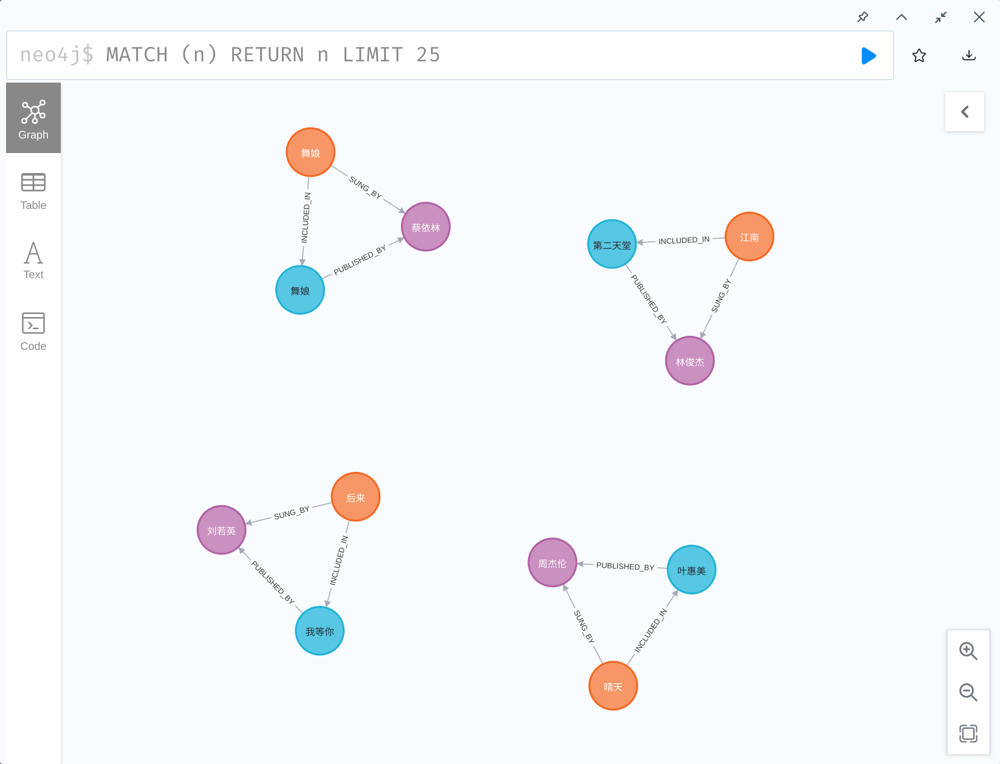

# [Chapter 06] 基于知识库的问答

## Rasa 版本和项目依赖

本书所用代码均在 Rasa 3.0.X 版本中完成。
读者可以使用：

```shell
pip install --no-deps -r ../full_requirements.txt
```

完成项目代码的依赖安装。

## 训练 Rasa 模型

```bash
rasa train
```

## 启动 Rasa 动作服务器

### 内置知识库

```shell
rasa run actions
```

### 使用自定义 Neo4j 知识库

#### 安装 Docker

您需要 docker 才能使用（可选）自定义 neo4j 知识库功能.
您可以在 [https://www.docker.com/](https://www.docker.com/) 找到如何将 docker 安装到您的系统.

#### 安装 neo4j 库

为了使用（可选）自定义 neo4j 知识库功能，你还需要安装`neo4j`：

```bash
pip install neo4j~=4.1
```

这一步骤是可选的，因为在最开始的步骤中，已经安装了相关的依赖。

#### 启动 neo4j 服务器

拉取 docker 镜像：

```bash
docker pull neo4j:4.1
```

运行 docker：

```bash
docker run --rm --env=NEO4J_AUTH=none --publish=7474:7474 --publish=7687:7687 neo4j:4.1
```

保持这个 neo4j 运行。

#### 将图插入到 neo4j

```bash
python ./data_to_neo4j.py
```

#### 使用自定义 neo4j 知识库启动 Rasa 动作服务器

```bash
USE_NEO4J=1 rasa run actions
```

## 启动 Rasa 服务器

```bash
rasa run --cors "*"
```

## 启动网页客户端

```bash
python -m http.server
```

使用浏览器打开链接: [http://localhost:8000/](http://localhost:8000/)

尝试输入一些查询，例如“给我列出一些周杰伦的歌曲”并查看响应。

演示效果如下所示：


玩得开心！

## 探索 Graph

启动 Neo4j 后，您可以使用 Neo4j 浏览器进行可视化和 GraphQL 调试.
访问 [http://localhost:7474](http://localhost:7474) ，使用 `neo4j` 作为用户名和密码。

演示效果如下所示：


