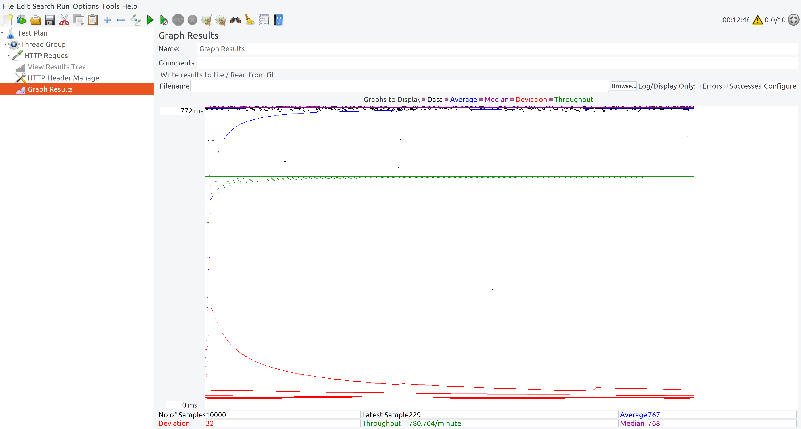
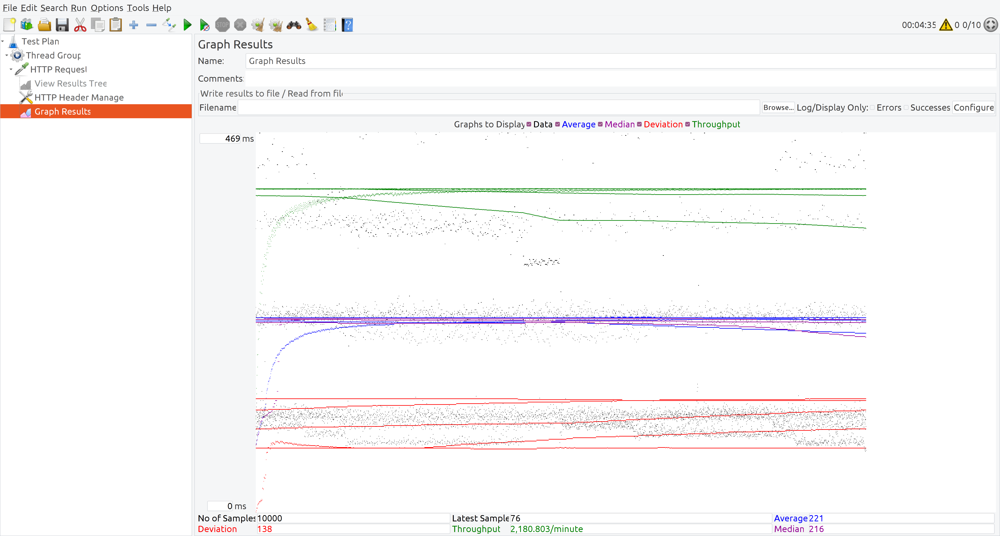

# [Chapter 08] 测试和生产环境部署

## Rasa 版本和项目依赖

本书所用代码均在 Rasa 3.0.X 版本中完成。
读者可以使用：

```shell
pip install --no-deps -r ../full_requirements.txt
```

完成项目代码的依赖安装。

## 安装 Docker

您需要 docker 才能使用 redis.
您可以在 [https://www.docker.com/](https://www.docker.com/) 找到如何将 docker 安装到您的系统.

## 拉取 redis 的 docker 镜像

```bash
docker pull redis:6.2.5
```

## 运行 redis

```bash
docker run --rm -p 6379:6379 --name docker-redis redis:6.2.5
```

## 训练 Rasa 模型

```bash
rasa train
```

## 以默认设置运行 Rasa

### 运行服务器

```bash
CUDA_VISIBLE_DEVICES=-1 rasa run --endpoints ./endpoints_default.yml
```

为了和多 worker 模式下的 Rasa 服务器比较性能，使用 `CUDA_VISIBLE_DEVICES=-1` 设置，将模型加载到 CPU 上（而不是 GPU）。

### 运行动作服务器

```bash
rasa run actions
```

## 以多 worker 的形式运行 Rasa

### 运行服务器

```bash
CUDA_VISIBLE_DEVICES=-1 SANIC_WORKERS=5 rasa run
```

因为通常情况下显卡的内存不足以载入多个模型，因此使用 `CUDA_VISIBLE_DEVICES=-1` 设置，将模型加载到 CPU 上（而不是 GPU）。

### 运行动作服务器

```bash
ACTION_SERVER_SANIC_WORKERS=5 rasa run actions
```

## JMeter 测试

测试文件是 RasaPerformance.jmx (软件 Apache JMeter 5.4.1)

默认模式的性能：



多 woker 模式下的性能：


