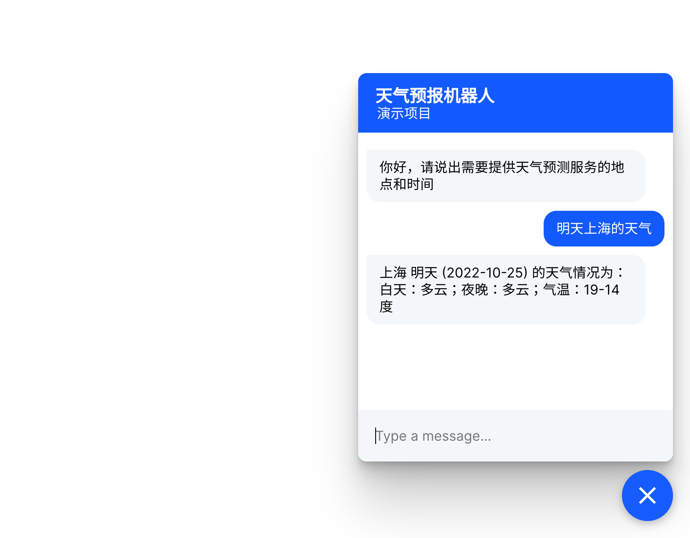

# [Chapter 09] Rasa 的工作原理与扩展性

## Rasa 版本和项目依赖

本书所用代码均在 Rasa 3.0.X 版本中完成。
读者可以使用：

```shell
pip install --no-deps -r ../full_requirements.txt
```

完成项目代码的依赖安装。

## 安装依赖

```bash
pip install MicroTokenizer
```

这一步骤是可选的，因为在上一步骤中，已经安装了相关的依赖。

## 自定义组件

自定义组件位于 `rasa_custom_tokenizer/tokenizer.py`

## 训练 Rasa 模型

```shell
rasa train
```

## 使用 API 密钥启动 Rasa 动作服务器

```shell
SENIVERSE_KEY=xxx rasa run actions
```

`xxx` 是我们可以从 [https://www.seniverse.com/](https://www.seniverse.com/) 获取的 API 密钥.

对于 Windows 用户，可以使用直接修改代码的方式，快速更改 API
密钥。具体操作如下：

1. 打开 `service/weather.py` 文件，定位到第 9 行，也就是：
   `KEY = os.getenv("SENIVERSE_KEY", "")  # API key` 这一行
2. 将其中的 `""` 替换成 API 密钥。代码修改效果如下：
   `KEY = os.getenv("SENIVERSE_KEY", "ThisIsYourKey")  # API key`

## 启动 Rasa 服务器

```bash
rasa run --cors "*"
```

## 启动网页客户端

```bash
python -m http.server
```

尝试输入一些查询，例如“上海今天的天气如何”并查看响应。

演示效果如下所示：



玩得开心！
