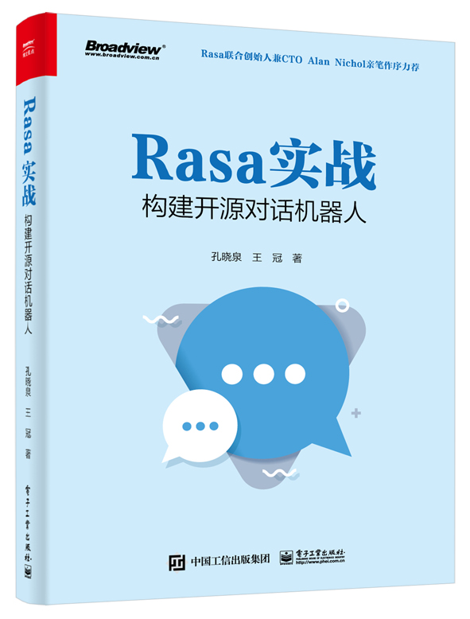
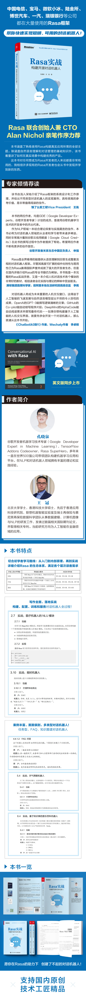

<div align="center">
  
</div>

# 《Rasa 实战：构建开源对话机器人》官方随书代码 | The official source code of *Rasa in Action: Building Open Source Conversational AI*

全球首本关于 Rasa 的中文图书。Rasa 联合创始人兼 CTO Alan Nichol 亲笔作序力荐。快速创建工业级智能对话机器人。

The world's first Chinese book on the Rasa framework, with a foreword by Rasa co-founder and CTO Alan Nichol. It helps developers quickly create industrial-grade conversational chatbots.

## 内容简介 | Summary

Rasa 是一款开源的对话机器人框架，能让开发者使用机器学习技术快速创建工业级的对话机器人。得益于丰富的功能、先进的机器学习能力和可以快速上手的特性，Rasa 框架是目前流行的开源对话机器人框架。
本书首先介绍 Rasa 的两个核心组件——Rasa NLU 和 Rasa Core 的工作流程；然后详细介绍通过使用 Rasa 生态系统从头开始构建、配置、训练和服务不同类型的对话机器人的整体过程，如任务型、FAQ、知识图谱聊天机器人等，其中包括使用基于表单（form）的对话管理、ResponseSelector 来处理闲聊和 FAQ，利用知识库来回答动态查询的问题等，以及自定义 Rasa 框架，使用对话驱动的开发模式和工具来开发对话机器人，探索机器人能做什么，并通过交互式学习来轻松修复它所犯的任何错误；最后会介绍将 Rasa 系统部署到具有高性能和高可扩展性的生产环境中，从而建立一个高效和强大的聊天系统。

Rasa is an open-source conversational AI framework that enables developers to quickly create industrial-grade conversational AI using advanced machine learning techniques. Benefited from its rich functionality, powerful machine learning capabilities, and the ability to get started quickly, the Rasa framework is a popular open-source conversational bot framework today.
The book first introduces the workflow of Rasa's two core components, Rasa NLU and Rasa Core. It then details the overall process of building, configuring, training, and serving different conversational bots from scratch. The content covers all the common bot types, such as task-oriented bots, chitchat/FAQ chatbots, knowledge-graph-based bots. In addition, it includes the usage of story-based dialog management, form-based dialog management, ResponseSelector, knowledge-based action. Furthermore, it discussed the customizing of the Rasa framework, conversation-driven development patterns, tools, how to spot the bug, fix them, etc. And finally, it advises about deploying the Rasa system into a production environment with high performance and scalability.

## 作者团队 | Author team

[孔晓泉 | Xiaoquan Kong](https://github.com/howl-anderson)、[王冠 | Guan Wang](https://github.com/crownpku)

## 关于本书 | About this book

<div align="center">
  
</div>

## 如何购买? | Where to buy this book

[京东 | JD](https://item.jd.com/13624358.html)

## Rasa 版本和项目依赖

本书所用代码均在 Rasa 3.0.X 版本中完成。
读者可以使用：

```shell
pip install --no-deps -r ./full_requirements.txt
```

完成项目代码的依赖安装。

## 随书代码目录

1. [[Chapter 01] 人机对话基础和 Rasa 简介](Chapter01/README.md)
2. [[Chapter 02] Rasa NLU 基础](Chapter02/README.md)
3. [[Chapter 03] Rasa Core 基础](Chapter03/README.md)
4. [[Chapter 04] 使用 ResponseSelector 实现 FAQ 和闲聊功能](Chapter04/README.md)
5. [[Chapter 05] 基于规则的对话管理](Chapter05/README.md)
6. [[Chapter 06] 基于知识库的问答](Chapter06/README.md)
7. [[Chapter 07] 实体角色和分组](Chapter07/README.md)
8. [[Chapter 08] 测试和生产环境部署](Chapter08/README.md)
9. [[Chapter 09] Rasa 的工作原理与扩展性](Chapter09/README.md)

## 姊妹篇 | Companion

本书的作者团队在 2021 年年末出版了全球第一本关于 Rasa 框架的图书。这本书同样由 Rasa 联合创始人兼 CTO Alan Nichol 作序推荐，面向英文开发者，基于 Rasa 2.0 开发，是本书的姊妹篇。该书可以在 [亚马逊图书](https://www.amazon.com/dp/1801077053) 购买。

The authors of this book published the world's first book on the Rasa framework in late 2021. That book, also with a foreword by Rasa co-founder and CTO Alan Nichol, is aimed at English-speaking developers and is based on Rasa 2.0. It is available at [Amazon Books](https://www.amazon.com/dp/1801077053).

## 版权申明 | Copyright statement

保留所有权利。不得将本仓库提供的源代码用于其他项目，包括但不限于开源或者闭源项目、图书写作、论文写作、专利申请、著作权申请、教程制作等。如确实需要使用本仓库提供的源代码，请联系作者团队以获取授权。

All rights reserved. The source code provided by this repository may not be used for other projects, including but not limited to open source or closed source projects, book writing, thesis writing, patent applications, copyright applications, tutorial production, etc. If you really need to use the source code provided by this repository, please contact the author team to obtain a license.

## 致谢 | Acknowledge

* 感谢王胤（前饿了么工程副总裁）、申强（谷歌开发者关系生态中国区负责人）、李佩（满帮集团首席科学家，前阿里巴巴本地生活研究院高级总监）和李卓桓（Wechaty 框架的创始人）为本书写作了推荐语。 | Thank you to Alex (former VP of Engineering at ELE.ME), Brian (Head of Google Developer Relations Ecosystem China), Leo (Chief Scientist at Full Truck Alliance, Former Senior Director of Alibaba Local Life Research Institute) and Huan (Founder of Wechaty Framework) for writing testimonials for this book.
* 感谢谷歌通过提供谷歌云信用额度（Google Cloud Credits）的方式来支持这项工作 | Google supported this work by providing Google Cloud credit

## Credits

* 前端项目中的 `index.js` 来自 [Rasa Webchat](https://github.com/botfront/rasa-webchat) 项目，从 https://cdn.jsdelivr.net/npm/rasa-webchat@1.0.1/lib/index.js 处获得的。 |   The `index.js` in the front-end project is from the [Rasa Webchat](https://github.com/botfront/rasa-webchat) project, which you can get from https://cdn.jsdelivr.net/npm/rasa-webchat@1.0.1/ lib/index.js.
